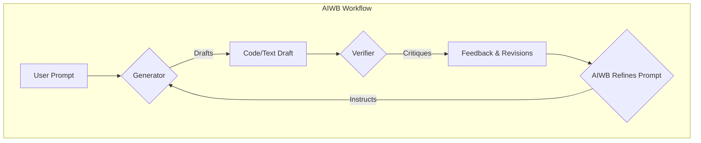

# AIWB (AI Workbench) 🤖

> Tired of one-shot AI prompts that miss the mark? Stop wrestling with single models. **Start orchestrating them.**

AIWB is a command-line toolkit for developers who want to elevate their AI-driven workflow. It introduces a powerful **Generator-Verifier** loop, turning a simple prompt into a sophisticated, multi-stage collaboration between different AI models.

<div align="center">

[](https://www.gnu.org/licenses/gpl-3.0)
[](https://github.com/juanitto-maker/AIworkbench-core/issues)
[](https://github.com/juanitto-maker/AIworkbench-core/commits/main)

</div>

---

## 💡 The Core Concept: AI Collaboration

The magic of AIWB is its unique feedback loop. It mimics a professional developer and code reviewer team, resulting in higher-quality, refined output.



---

## ✨ Features at a Glance

| Feature | Description |
| :--- | :--- |
| **Direct Repo Integration** | **NEW!** Set AIWB's context to an existing Git repository to have the AI edit, debug, and refactor your files directly. |
| **Hybrid AI Engine** | Go beyond single-model prompting. Our unique Generator-Verifier loop uses multiple AIs to create, critique, and improve work autonomously. |
| **Smart Cost Control** | Never get a surprise API bill again. The `gpre` and `quote` commands provide detailed, tiered cost estimates *before* you run anything. |
| **Streamlined Workflow** | A full suite of CLI tools (`pset`, `tnew`, `tedit`) lets you manage your projects and tasks without ever leaving the terminal. |
| **Built for the Command Line** | A fast, keyboard-driven interface designed for power users on Linux and Termux. |
| **Open & Extensible** | Easily add new models, including your own local LLMs running on Ollama or other servers. |

---

## 🚀 Get Started in 3 Steps

Get up and running in minutes.

### 1\. Clone the Repo
```bash
git clone [https://github.com/juanitto-maker/AIworkbench-core.git](https://github.com/juanitto-maker/AIworkbench-core.git)
cd AIworkbench-core
```

### 2\. Configure Your Keys
```bash
# Create your personal environment file from the template
cp .env.example .env
# Add your API keys
nano .env
```

### 3\. Update Your PATH
Make the AIWB commands available from anywhere.
```bash
# Add this line to your ~/.bashrc or ~/.zshrc file
export PATH="$PATH:$(pwd)/bin"
# Reload your shell to apply the changes
source ~/.bashrc
```

---

## 🗺️ Roadmap

We're on a mission to build the ultimate command-line AI assistant. Join us!

* **Phase 1:** Consolidate core scripts, create a robust installer, and implement direct file editing within project contexts.
* **Phase 2:** Add support for more models (OpenAI, Ollama), integrate Git for auto-commits, and build an interactive TUI.
* **Phase 3:** Launch the "Autonomous Agent" that can run the refinement loop independently and perform file system operations.

For more details, see the [ROADMAP.md](docs/ROADMAP.md) file.

---

## ❤️ Join the Crew & Support

This is an open-source project built by and for the community. Please consider contributing or supporting our work.

<a href="https://github.com/sponsors/juanitto-maker">

</a>
<a href="https://ko-fi.com/YOUR_KOFI_USERNAME">

</a>

---

This project is licensed under the GPL-3.0 License - see the [LICENSE](LICENSE) file for details.
