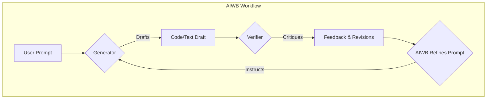

# AIWB (AI Workbench) 🤖

> Tired of one-shot AI prompts that miss the mark? Stop wrestling with single models. **Start orchestrating them.**

AIWB is a command-line toolkit for developers who want to elevate their AI-driven workflow. It introduces a powerful **Generator-Verifier** loop, turning a simple prompt into a sophisticated, multi-stage collaboration between different AI models.

<div align="center">

[](https://www.gnu.org/licenses/gpl-3.0)
[](https://github.com/juanitto-maker/AIworkbench/issues)
[](https://github.com/juanitto-maker/AIworkbench/commits/main)

</div>

---

## 💡 The Core Concept: AI Collaboration

The magic of AIWB is its unique feedback loop. It mimics a professional developer and code reviewer team, resulting in higher-quality, refined output.


```mermaid
graph TD
    subgraph AIWB Workflow
        A[User Prompt] --> B{Generator};
        B -- Drafts --> C[Code/Text Draft];
        C --> D{Verifier};
        D -- Critiques --> E[Feedback & Revisions];
        E --> F{AIWB Refines Prompt};
        F -- Instructs --> B;
    end
```

---

## ✨ Features at a Glance

| Feature | Description |
| :--- | :--- |
| **Mode-Based Workflows** | Powerful `/make`, `/tweak`, and `/debug` modes with structured, multi-step AI workflows for complex tasks. |
| **Hybrid AI Engine** | Go beyond single-model prompting. Our unique Generator-Verifier loop uses multiple AIs to create, critique, and improve work autonomously. |
| **Multi-Provider Support** | Support for Gemini, Claude, OpenAI, Groq, xAI/Grok, and Ollama (local models) - switch providers on the fly. |
| **Smart Cost Control** | Built-in cost estimation and tracking. View real-time spending breakdown by provider and never get surprised by API bills. |
| **Context Management** | Upload files and directories to provide context to AI. Supports multiple file types and intelligent context building. |
| **Built for the Command Line** | Fast, keyboard-driven interface with beautiful TUI using `gum`, designed for power users on Linux, macOS, and Android (Termux). |
| **Open & Extensible** | Modular architecture with plugin support. Easily add new models, templates, and extend functionality. |

---

## 🚀 Get Started in 3 Steps

Get up and running in minutes.

### 1\. Install AIWB
```bash
# One-line install (recommended)
curl -fsSL https://raw.githubusercontent.com/juanitto-maker/AIworkbench/main/install.sh | bash

# Or manual install
git clone https://github.com/juanitto-maker/AIworkbench.git
cd AIworkbench
./install.sh
```

### 2\. Add to PATH
Ensure `~/.local/bin` is on your PATH:
```bash
export PATH="$HOME/.local/bin:$PATH"
echo 'export PATH="$HOME/.local/bin:$PATH"' >> ~/.bashrc
source ~/.bashrc
```

### 3\. Configure API Keys
```bash
# Start AIWB and use the interactive setup
aiwb
# Then type: /keys

# Or configure manually
aiwb keys
```

---

## 🤖 AI Assistant Usage

When using Claude Code or similar AI assistants with this codebase:

**IMPORTANT:** Read `context/docs/CLAUDE_QUICK_REF.md` before starting work.

This ensures efficient context loading and preserves rate limits by instructing the AI to:
- Load only 1-3 files initially
- Expand context incrementally as needed
- Focus on specific files mentioned in your request
- Ask before loading additional dependencies

**Quick start:** Begin your session with:
Read context/docs/CLAUDE_QUICK_REF.md first, then [your task]

---

## 🗺️ Roadmap

We're on a mission to build the ultimate command-line AI assistant. Join us!

For a detailed breakdown of our future plans, see the [docs/ROADMAP.md](docs/ROADMAP.md) file.

---

## 💻 Quick Usage Examples

### Interactive Chat
```bash
# Start interactive mode
aiwb

# Try these commands
> /make              # Enter make mode to generate code
> /quick Create a Python password generator
> /wizard            # Guided workflow for beginners
> /help              # Show all commands
```

### Mode-Based Workflows
```bash
aiwb
> /make              # Enter make mode
make> prompt Create a REST API for user management
make> model          # Choose your AI model
make> uploads ./docs/ ./src/
make> check Focus on security and error handling
make> run            # Execute with cost estimation
```

### Quick Commands
```bash
# One-shot generation with verification
aiwb quick "Create a sorting algorithm in Python"

# Start with wizard (great for beginners)
aiwb wizard

# Check system health
aiwb doctor
```

### Configuration
```bash
# Manage API keys
aiwb keys

# Configure settings
aiwb settings

# Check costs
aiwb costs
```

For detailed documentation, see [QUICKSTART.md](QUICKSTART.md) and [docs/](docs/).

## ❤️ Join the Crew & Support

This is an open-source project built by and for the community. Please consider contributing or supporting our work.

<a href="https://github.com/sponsors/juanitto-maker">

</a>
<a href="https://ko-fi.com/guardos">

</a>

---

This project is licensed under the **GPL-3.0 License** - see the [LICENSE](LICENSE) file for details.
